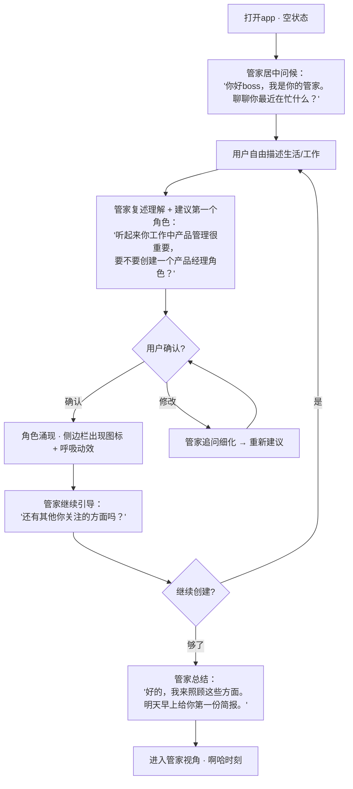
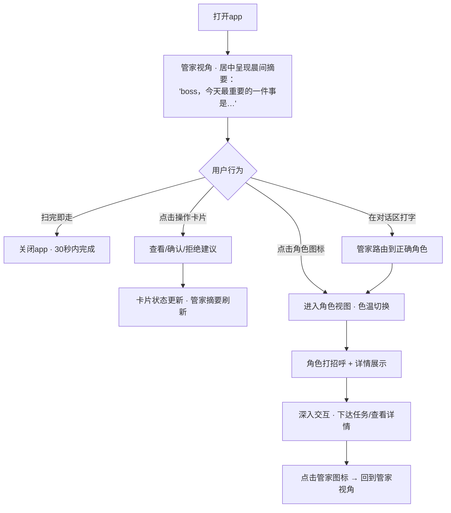
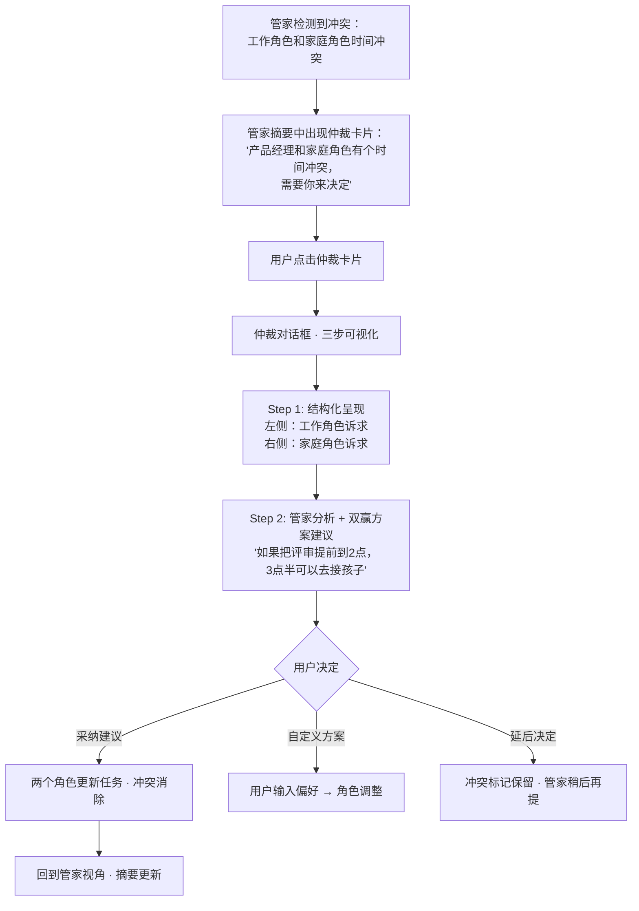
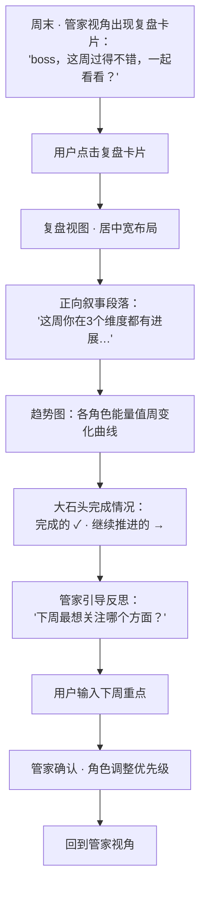
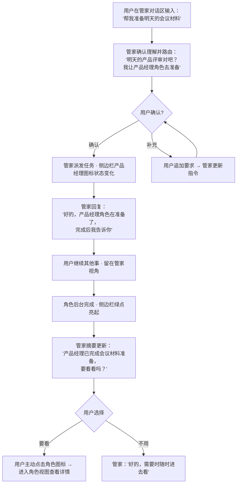

# UX Design Specification EgoSync

**Author:** boss
**Date:** 2026-05-18

---

## Executive Summary

### Project Vision

EgoSync是一个桌面端（Tauri）应用，将用户内在的多个自我外化为可协作的AI Agent。核心交互模式是**对话流+仪表盘融合**——用户通过一个"管家"Agent总入口与多个"角色"Agent协作管理人生各个职能维度。

产品定位不是效率工具，而是"认知伙伴"——角色不是用完消失的助手，而是持续运行的自治Agent，在用户不活跃时依然审视目标、跟踪任务、沉淀记忆。V1为纯本地桌面应用，支持Windows/macOS/Linux。

### Target Users

**主要用户画像：知识工作者boss**
- 25-45岁，同时承担多个人生角色（职业人、家长、学习者、管理者等）
- 使用过多种效率工具（日历、TODO、Notion、AI聊天）但感到碎片化
- 对AI有基本认知，愿意尝试新工具，但对数据隐私敏感
- 桌面端优先用户（V1无移动端）

**核心体验期望：**
- 5分钟内感到"被理解"——冷启动的魔力
- 30秒内获得"全局掌控感"——晨间简报的效率
- 持续的"有人在帮我看着"安心感——角色的后台存在感
- 绝对的数据安全感——本地优先、透明可审计

### Key Design Challenges

1. **冷启动的魔力 vs 摩擦**：新用户打开空应用时，如何让"对话涌现角色"既自然又快速。空状态引导必须是有温度的对话而非表单填写，同时在5分钟内达成"啊哈时刻"。

2. **双模态融合（对话流 + 仪表盘）**：用户需要在"轻量聊天模式"（低信息密度）和"信息密集控制台模式"（高信息密度）之间无缝切换。两种截然不同的信息密度在同一界面中共存是核心布局挑战。

3. **多Agent角色切换的心智负担**：用户可能有3-7个角色，每个有独立对话历史和任务。切换时的上下文恢复、视觉差异化、"我在哪"的定位感至关重要。

4. **主动性的"恰到好处"**：三级通知（耳语/轻触/敲门）+ 角色主动建议——如何让系统感觉"贴心"而非"烦人"。过度通知导致用户关闭功能，过少则失去"持续存在"感。

5. **复杂信息的温度呈现**：晨间简报、冲突仲裁、周复盘都是信息密集场景，但要求以"自然语言、有温度感"呈现而非冰冷列表。信息可读性与情感温度需要平衡。

### Design Opportunities

1. **角色卡片的"呼吸感"**：通过能量值变化、状态微动效、被忽视时暗淡等视觉语言，让角色卡片成为"活的实体"，创造独一无二的情感连接。

2. **角色切换的氛围变化**：微妙的色温变化（工作偏冷、家庭偏暖）是低成本高感知的差异化手段，强化"每个角色是独立人格"的认知。

3. **冲突仲裁作为"仪式"**：将角色冲突从焦虑源转化为有结构、有依据、有双赢方案的决策仪式——在竞品中完全不存在的交互创新。

4. **"沉默智慧"**：管家不说话的时刻跟说话同等重要。刻意设计的留白和沉默，传递"我在观察但你不需要我时我不打扰"的智慧感。

## Core User Experience

### Defining Experience

EgoSync的核心体验是**"扫一眼+快速交互"**——用户打开app后，仪表盘全景是主视觉焦点（角色卡片、能量值、待处理建议一目了然），管家对话区常驻可见作为交互入口。用户通过视觉扫描获取80%信息，需要深入时点击角色卡片进入角色视图或在管家对话区打字。

核心体验loop：**打开app → 仪表盘扫全局状态 → 发现需要处理的事项 → 快速交互（确认建议/点击角色/对话下达任务）**

仪表盘和对话同屏共存，仪表盘占主区域，管家对话区常驻不需切换页面。

### Platform Strategy

- **V1**: 桌面端（Tauri），Windows/macOS/Linux
- **输入方式**: 鼠标扫描+点击为主（仪表盘交互、建议确认/拒绝），键盘打字为辅（管家/角色对话）
- **离线能力**: 完全离线可用（本地SQLite + 本地模型时），云端模型需联网
- **跨平台一致性**: LLM流式输出渲染层统一抽象，三平台视觉和交互体验一致
- **性能约束**: Tauri WebView渲染，需控制DOM复杂度；角色卡片动效需60fps

### Effortless Interactions

1. **全局状态一眼可得**：打开app瞬间获取所有角色状态、紧急事项、待处理建议，无需点击展开或滚动查找。
2. **意图理解零重复**：用户说一次，管家就准确理解。误解时管家主动确认而非静默执行错误。
3. **角色切换零等待**：点击角色卡片瞬间切换上下文，对话历史和任务面板同步切换。
4. **建议处理一键化**：角色的主动建议以"确认/拒绝"呈现，一个动作完成，无需进入子流程。
5. **晨间简报即行动**：简报中的任务/建议可直接确认或追问，不需要切换到角色再操作。

### Critical Success Moments

1. **Make-or-break**: 冷启动前5分钟（UJ-1）——与管家对话创建第一个角色，感受到"被理解"。
2. **Daily hook**: 晨间简报质量（UJ-2）——每天第一屏必须有用、有温度、可行动。
3. **Trust builder**: 任务正确执行（UJ-5）——准确理解任务范围，缺工具时主动说明而非硬撑，结果符合预期。
4. **Value proof**: 首次冲突仲裁（UJ-3）——展示超越"效率工具"的价值。

### Experience Principles

1. **一眼全局（Glanceable Overview）**：仪表盘是主界面，用户不打字也能获取80%所需信息。视觉扫描 > 文字阅读 > 对话查询。
2. **一次说对（Get It Right the First Time）**：意图理解准确性是第一优先级。宁可主动确认，不可静默误解。
3. **有温度的专业（Warm Professionalism）**：信息输出以自然语言段落为主，管家像人一样说话，内容专业可靠。
4. **透明可控（Transparent & Controllable）**：随时追问"为什么"，随时修正系统判断，随时调节角色主动性。
5. **沉默是金（Silence is Wisdom）**：不打扰 > 打扰。每一次通知都必须值得用户注意力。

## Desired Emotional Response

### Primary Emotional Goals

1. **掌控感（In Control）**：用户在任何时刻都清楚全局状态，感到"我的人生被照顾着"而非"我在被AI管理"。
2. **被理解（Understood）**：角色和管家的回应让用户感到"它真的懂我"，而非"它在走模板"。
3. **信任（Trust）**：系统的每个行为都可预期、可追问、可修正。出错时自然修正，不掩饰不推卸。
4. **温暖的安心（Warm Reassurance）**：日式管家式的细腻关怀——不等你开口就准备好了，但从不越界。

### Emotional Journey Mapping

| 阶段 | 期望情感 | 设计手段 | 要避免的情感 |
|---|---|---|---|
| **首次打开（空状态）** | 好奇、被关注 | 管家主动开口、温暖的引导对话 | 困惑、被审视 |
| **创建第一个角色** | "被理解了" | 对话式引导而非表单，管家复述理解 | "在填表格" |
| **每日扫仪表盘** | 掌控感、安心 | 视觉优先级清晰，呼吸感卡片 | 信息过载、焦虑 |
| **晨间简报** | 温暖、被照顾 | 自然语言段落，"今天最重要的一件事" | 被催促、压力感 |
| **角色主动建议** | 惊喜、被懂 | 精准的建议时机，一键确认/拒绝 | 被打扰、烦躁 |
| **任务正确执行** | 信任、轻松 | 完成后清晰汇报，可追问细节 | 怀疑、需反复核查 |
| **冲突仲裁** | 清晰、释然 | 结构化呈现+双赢方案+决定权在你 | 焦虑加重 |
| **角色被忽视** | 温和提醒→自然行动 | 卡片暗淡+管家侧面提及 | 强烈负罪感 |
| **周复盘** | 成长感、自豪 | 正向叙事为主，引导反思而非打分 | "被评判" |
| **系统出错** | 被尊重 | 自然修正："让我重新理解一下" | 被推卸责任 |

### Micro-Emotions

**信任 vs 怀疑**
- 最关键的微情感轴。每次准确理解任务+1信任，每次误解但自然修正维持信任，每次静默执行错误-3信任。
- 设计原则：宁可多确认一次，不可静默出错。

**被照顾 vs 被管理**
- 日式管家的核心区分：预判需求而非下达指令。管家说"boss，明天有个重要会议，我已经让产品经理角色准备好了材料概要"，而非"你明天有会议，请准备材料"。
- 设计原则：管家永远是"为你做好了"，不是"你该去做"。

**温和驱动 vs 负罪施压**
- 角色能量值下降时：卡片渐渐暗淡（视觉暗示），管家在合适时机侧面提及"健身教练角色最近有点安静了"（温和提醒），而非弹窗警告"你已经3天没关注健身了！"。
- 设计原则：暗示 > 提醒 > 告知，永远不施压。

**成长感 vs 被评判感**
- 周复盘的叙事框架必须是"看看你的进步"而非"看看你的成绩"。未完成的大石头不是"失败"，而是"继续推进的方向"。
- 设计原则：正向叙事包裹真实数据。

### Design Implications

| 情感目标 | UX设计决策 |
|---|---|
| 掌控感 | 仪表盘全景为主界面，角色状态一眼可得 |
| 被理解 | 管家/角色复述理解后再执行，确认而非假设 |
| 信任 | 推理可溯源（FR-29），不确定性主动表达（FR-30），出错时自然修正 |
| 温暖安心 | 日式管家语调：预判+准备+汇报，不催促不命令 |
| 温和驱动 | 能量值暗淡（视觉）+ 侧面提及（语言），无弹窗警告 |
| 成长感 | 周复盘正向叙事，趋势线而非打分 |

### Emotional Design Principles

1. **预判而非命令**：日式管家精神——"已经为您准备好了"优于"请您去做"。管家的价值在于让用户感到被照顾，而非被管理。
2. **暗示而非施压**：角色需要关注时通过视觉渐变（卡片暗淡）和管家侧面提及传递，永远不用弹窗警告或负面措辞。
3. **自然修正而非道歉**：出错时管家说"让我重新理解一下你的意思"，自然过渡到正确路径。不过度道歉（显得不可靠），不掩饰（破坏信任）。
4. **正向叙事包裹真实**：所有反馈和复盘以成长视角呈现。未完成不是失败，是"继续推进的方向"。数据真实，叙事正向。
5. **沉默传递智慧**：管家不说话时，用户应感到"它在观察和思考"，而非"它坏了"或"它不关心"。微妙的状态指示器传递"我在"。

## UX Pattern Analysis & Inspiration

### Inspiring Products Analysis

#### 1. Notion — 信息密度管理大师

- **核心优势**：在同一界面中优雅地容纳高密度和低密度信息。侧边栏提供全局导航，主区域根据内容类型动态调整密度。
- **可借鉴**：页面切换时内容区域平滑过渡，侧边栏保持稳定锚点。角色切换时仪表盘→角色详情的过渡可参考。
- **要警惔**：Notion的灵活性导致新用户不知道从哪开始。EgoSync必须避免"空白画布恐惧"——管家的引导对话就是解药。

#### 2. Linear — 极致效率的仪表盘

- **核心优势**：状态一目了然，视觉优先级极其清晰（颜色编码、图标状态）。键盘快捷键覆盖所有高频操作。动效克制但精确。
- **可借鉴**：任务卡片的状态视觉语言——颜色+图标+位置三重编码。角色卡片可参考这种多维状态编码（能量值色彩+呼吸动效+待处理徽章）。
- **要警惔**：Linear偏冷、偏工程师。EgoSync需要更多温度感，不能完全复制其极简风。

#### 3. Arc Browser — 空间与氛围切换

- **核心优势**：Profile切换时整个浏览器色调变化，瞬间建立"我在不同空间"的心智感知。侧边栏的空间组织逻辑。
- **可借鉴**：角色切换时的色温氛围变化直接可参考。工作角色偏冷色调，家庭角色偏暖色调，学习角色偏中性。
- **要警惔**：Arc的空间概念对部分用户来说太重。EgoSync的角色切换必须比Arc更轻量——点击即切，无需"创建空间"。

#### 4. ChatGPT/Claude — 对话式交互标杆

- **核心优势**：流式输出创造"AI在思考"的感知。对话历史的组织和检索。输入框的简洁和可扩展性。
- **可借鉴**：流式输出的渲染体验（逐字出现+Markdown实时渲染）。管家/角色对话区必须达到同等流畅度。
- **要警惔**：纯对话界面的信息密度太低——用户需要滚动大量对话才能找到关键信息。EgoSync通过仪表盘解决这个问题。

#### 5. Apple Watch 表盘 — Glanceable设计极致

- **核心优势**：在极小空间内展示多个数据源的关键状态。复杂功能（Complications）组件化，用户自由组合。信息层级极度精炼。
- **可借鉴**：角色卡片的信息密度设计——每张卡片展示角色名/能量值/最近动态/待处理数，在最小空间内传递最多信息。
- **要警惔**：手表的交互模式不适用于桌面端。信息精炼但交互入口要比手表更丰富。

### Transferable UX Patterns

**导航模式**
- **稳定侧边栏 + 动态主区域**（Notion）：左侧角色列表/管家入口始终可见，右侧根据选中角色动态切换内容。
- **氛围切换**（Arc）：角色切换时主区域色温微调，建立空间感。

**交互模式**
- **多维状态编码**（Linear）：角色卡片用颜色（能量值）+ 动效（呼吸感）+ 徽章（待处理数）三维编码状态。
- **流式对话输出**（ChatGPT/Claude）：管家/角色对话区的实时流式渲染。
- **一键操作**（Linear）：建议确认/拒绝、任务状态变更等高频操作一键完成。

**视觉模式**
- **Glanceable组件**（Apple Watch）：角色卡片作为独立信息组件，最小空间最大信息量。
- **呼吸感动效**（自创）：角色卡片的微妙脉动——活跃角色有生命力，被忽视角色渐暗。竞品中不存在的创新。
- **深色主题+色温变化**（Arc + PRD调性）：沉稳深色为基础，角色切换时局部色温变化。

### Anti-Patterns to Avoid

1. **空白画布恐惧**（Notion早期）：新用户面对空界面不知所措。EgoSync用管家引导对话消除。
2. **通知轰炸**（Slack）：多频道/多Agent主动推送失控。EgoSync用三级通知+每日敲门上限约束。
3. **对话即一切**（ChatGPT）：所有信息埋在对话流中，找历史信息靠滚动。EgoSync用仪表盘+结构化记忆解决。
4. **过度配置**（Notion模板系统）：灵活性导致上手成本高。EgoSync角色从对话涌现，Skill可选配置，默认开箱即用。
5. **冷冰冰的效率**（Linear/Jira）：纯效率工具缺乏情感连接。EgoSync用日式管家温度+角色呼吸感+正向叙事差异化。

### Design Inspiration Strategy

**直接采用：**
- Linear的**多维状态编码**→ 角色卡片视觉系统
- ChatGPT的**流式输出渲染**→ 对话区体验
- Apple Watch的**Glanceable组件**思维 → 角色卡片信息密度

**适配改造：**
- Notion的**侧边栏+主区域**布局 → 改为仪表盘占主区域，对话区嵌入（非Notion的主区域独占）
- Arc的**Profile色温切换** → 简化为角色切换时主区域背景色微调（不改变整个应用框架）

**明确避免：**
- Notion的空白画布模式
- Slack式通知轰炸
- ChatGPT式对话独占界面
- Jira式冷冰冰的效率工具感

## Design System Foundation

### Design System Choice

**方案：Tailwind CSS + shadcn/ui**

基于原子化样式系统（Tailwind CSS）和可复制组件库（shadcn/ui）构建EgoSync的设计系统。组件代码直接复制到项目中，完全可控，不依赖外部UI库版本更新。

### Rationale for Selection

1. **高度定制需求**：EgoSync需要独特的视觉语言（呼吸感卡片、色温变化、深色主题），成熟组件库（Ant Design/MUI）的定制成本反而更高。
2. **完全可控**：shadcn/ui的"复制代码"模式意味着角色卡片、通知面板、冲突仲裁对话框等核心组件可以按需深度定制。
3. **色温系统原生支持**：Tailwind的CSS变量系统天然支持角色切换色温变化——每个角色定义一组色彩token，切换时更新CSS变量即可。
4. **性能友好**：Tailwind编译后CSS极小，shadcn/ui组件轻量，适合Tauri WebView环境的DOM复杂度和渲染性能约束。
5. **长期自主可控**：不依赖外部UI库版本迭代，组件维护完全自主，与本地优先的产品理念一致。

### Implementation Approach

**技术栈组合：**
- **样式基础**：Tailwind CSS v4+，配置自定义设计token（色彩、间距、圆角、动效时长）
- **组件基础**：shadcn/ui提供基础组件（Button、Dialog、Card、Input、Sheet、Tooltip等）
- **自定义组件**：基于shadcn/ui扩展构建EgoSync专属组件（角色卡片、能量指示器、对话气泡、通知面板、仲裁对话框）
- **动效引擎**：CSS Transitions + Framer Motion（角色卡片呼吸感、色温过渡、页面切换）
- **图标**：Lucide Icons（与shadcn/ui默认配套）

**分层架构：**
```
design-tokens/     ← CSS变量：色彩、间距、字体、动效时长、角色色温表
ui-primitives/     ← shadcn/ui基础组件（少量定制）
ui-components/     ← EgoSync专属复合组件
layouts/           ← 页面布局（仪表盘布局、角色详情布局、设置布局）
themes/            ← 角色色温主题集合
```

### Customization Strategy

**设计Token体系：**

| Token类别 | 示例 | 用途 |
|---|---|---|
| 基础色彩 | `--bg-primary`, `--text-primary` | 全局深色主题 |
| 角色色温 | `--role-accent`, `--role-bg-tint` | 角色切换时动态更新 |
| 能量色谱 | `--energy-high`, `--energy-low` | 角色能量值可视化 |
| 动效时长 | `--breath-duration`, `--transition-fast` | 呼吸感、切换过渡 |
| 间距系统 | `--space-xs` ~ `--space-2xl` | 一致的布局节奏 |

**角色色温映射示例：**
- 工作角色：偏冷色调（蓝灰系）
- 家庭角色：偏暖色调（暖橙系）
- 学习角色：中性色调（紫灰系）
- 管家全局：基准深色（无色温偏移）

**自定义组件清单（需超越shadcn/ui基础构建）：**
1. `RoleCard` — 角色卡片（呼吸动效 + 能量指示 + 状态徽章）
2. `EnergyIndicator` — 能量值可视化组件
3. `ChatBubble` — 对话气泡（支持Markdown渲染 + 流式输出）
4. `NotificationPanel` — 三级通知面板
5. `ArbitrationDialog` — 冲突仲裁对话框（三步协议可视化）
6. `MorningBriefing` — 晨间简报卡片（自然语言+可操作建议）
7. `WeeklyReview` — 周复盘组件（趋势图 + 正向叙事）
8. `SuggestionAction` — 一键确认/拒绝建议组件

## Defining Core Experience

### Defining Experience

EgoSync的定义性交互是**"管家策展+角色召唤"**——用户打开app面对的不是信息平铺的仪表盘，而是管家精心筛选后的"此刻摘要"。角色安静地在侧边"呼吸着"，用户通过管家的汇总了解全局，需要深入时主动"把角色喊进来"。

一句话描述：**"管家告诉你今天该关注什么，你决定跟哪个'自己'深入聊。"**

**三层信息架构：**

| 层级 | 看到什么 | 信息密度 | 何时展开 |
|---|---|---|---|
| **Layer 1: 管家视角（默认首屏）** | 管家的"今日摘要"—2-3句自然语言概括全局 + 1-2个需要决定的事项 | 极低 | 打开app即看到 |
| **Layer 2: 角色缩略（侧边栏）** | 角色图标 + 能量指示小点（绿/黄/红），极简存在感 | 低 | 始终可见但不抢注意力 |
| **Layer 3: 角色深入（点击展开）** | 完整角色视图：对话历史、任务列表、详细状态 | 高 | 点击角色图标或管家提及时 |

**信息边界原则：** 管家只给摘要和入口，详情必须进入角色空间才能看到。管家是秘书而非替代者。

### User Mental Model

**角色 = 我的不同面**

用户不是在管理一个AI团队，而是在跟自己内在的不同维度对话。每个角色是"我的一部分"——我的职业面、我的家庭面、我的学习面。这决定了：

- **角色没有"头像"**：不是独立的人，而是维度/面向，用抽象图标+色彩区分
- **管家不是"另一个角色"**：管家是整合者，是"我的内在协调者"，比角色高一层
- **切换角色 = 切换自我视角**：不是"跟另一个人聊"，而是"切换到我关注这件事的那个自己"

**管家 = 我的内在秘书**

管家的心智模型是"帮我把纷繁的内在声音整理成清晰优先级的协调者"：
- 它知道所有角色在做什么，但只告诉我此刻最重要的
- 它负责翻译角色之间的需求为我能理解的语言
- 它的沉默 = "一切正常，不需要你操心"

### Success Criteria

1. **30秒内知道"今天最该做什么"**：打开app → 读完管家摘要 → 清楚优先级，全程不超过30秒。
2. **0次误导**：管家说"产品经理准备好了材料" → 用户进入角色 → 材料确实在那里。管家摘要与角色实际状态100%一致。
3. **不看角色也安心**：如果管家没提某个角色，用户信任"那边没事"。不需要逐个点进去确认。
4. **3次点击内完成任何操作**：从管家摘要出发，最多3步到达任何深度交互。

### Novel UX Patterns

**创新模式：管家策展层（Butler Curation Layer）**

这是EgoSync独有的交互创新——在用户和多Agent之间插入一个"策展层"：

- **已有模式**：Slack（所有频道平铺，用户自己扫）、ChatGPT（单对话流）
- **EgoSync创新**：管家作为信息过滤器，用自然语言段落呈现筛选后的全局状态。用户永远面对的是一个精心策展的视图，而非原始数据

**需要教育的新概念：**
- "角色在后台自主工作" → 通过侧边呼吸点和管家汇报传递这个概念
- "管家是整合者不是助手" → 通过管家主动策展行为（而非等用户问）建立认知

**复用的成熟模式：**
- 侧边栏导航（Notion）→ 角色缩略图标
- 流式对话输出（ChatGPT）→ 管家/角色对话
- 色温氛围切换（Arc）→ 进入角色后色温变化

### Experience Mechanics

**1. 启动（Initiation）**
- 用户打开app → 管家视角自动呈现
- 管家用2-3句自然语言段落汇总全局："boss，今天最重要的一件事是……另外，xxx角色想跟你聊一下……"
- 如果无事发生：管家说"今天一切平稳，各个角色都在正常推进各自目标。"

**2. 感知（Perception）**
- 侧边栏：角色缩略图标排列，极简存在感
- 每个图标旁有小点指示状态（绿=有就绪内容 / 蓝=想对话 / 无=正常）
- 图标有微妙呼吸动效——它们活着，但不吵
- 能量低的角色图标自然暗淡

**3. 交互（Interaction）**
- 用户点击侧边角色图标 → 主区域平滑切换到角色完整视图（色温变化+对话历史+任务面板）
- 或者在管家对话区打字下达任务 → 管家路由到正确角色
- 管家摘要中提及的角色名可点击，直接跳转

**4. 反馈（Feedback）**
- 进入角色后，角色以自然语言打招呼确认上下文："boss，上次我们聊到xxx，材料已经准备好了，要看看吗？"
- 任务执行中：角色汇报进度，完成后清晰总结
- 回到管家视角：管家更新摘要反映最新状态

**5. 回归（Return）**
- 用户随时可点击"管家"图标回到管家策展视角
- 管家视角自动更新反映刚才的交互结果
- 侧边角色状态点实时更新

## Visual Design Foundation

### Color System

**主题策略：双主题支持，默认浅色**

所有色彩通过CSS变量定义，主题切换时整组变量替换。

**浅色主题（默认）：**

| Token | 色值 | 用途 |
|---|---|---|
| `--bg-base` | #F8F9FA 柔和灰白 | 全局背景 |
| `--bg-surface` | #FFFFFF 纯白 | 卡片/面板背景 |
| `--bg-elevated` | #FAFAFA 微暖白 | 弹出层/浮层 |
| `--text-primary` | #1A1A2E 深灰 | 主要文字 |
| `--text-secondary` | #6B7280 中灰 | 次要文字 |
| `--text-muted` | #9CA3AF 浅灰 | 辅助信息 |
| `--border-default` | #E5E7EB 淡灰 | 分割线/边框 |

**深色主题：**

| Token | 色值 | 用途 |
|---|---|---|
| `--bg-base` | #0F1117 深墨 | 全局背景 |
| `--bg-surface` | #1A1B2E 深灰 | 卡片/面板背景 |
| `--bg-elevated` | #252638 微亮灰 | 弹出层/浮层 |
| `--text-primary` | #E8E8ED 柔白 | 主要文字 |
| `--text-secondary` | #9CA3AF 灰白 | 次要文字 |

**角色色温系统（叠加在主题上）：**

| 角色类型 | 色温倾向 | Accent色 | 说明 |
|---|---|---|---|
| 管家（全局） | 无偏移（中性） | #6366F1 蓝灰 | 管家视角默认状态 |
| 工作角色 | 冷色调 | #4F46E5 靖蓝 | 进入工作角色后色温微调 |
| 家庭角色 | 暖色调 | #D97706 琥珀 | 进入家庭角色后色温微调 |
| 学习角色 | 中性偏冷 | #7C3AED 紫罗兰 | 进入学习角色后色温微调 |
| 健康角色 | 自然色调 | #059669 翠绿 | 进入健康角色后色温微调 |

色温变化方式：进入角色后`--role-accent`和`--role-bg-tint`更新，侧边栏高亮色和主区域背景微调，过渡时长300ms。

**功能色：**
- 成功/就绪：#10B981（翠绿）
- 信息/想对话：#3B82F6（蓝）
- 警告/注意：#F59E0B（琥珀）
- 错误/紧急：#EF4444（红）

**能量值色谱：**
- 高能量（80-100%）：翠绿渐变
- 中能量（40-79%）：琥珀渐变
- 低能量（0-39%）：暗淡灰（非红色，避免负罪感）

### Typography System

**字体选择：**
- **英文/数字**：Inter（Variable）— 现代、清晰、适合UI和长文本
- **中文**：Noto Sans SC（思源黑体）— 与Inter高度协调，中性专业
- **代码/等宽**：JetBrains Mono — 角色执行任务时的代码/数据展示

**字阶体系：**

| 层级 | 大小 | 行高 | 字重 | 用途 |
|---|---|---|---|---|
| Display | 28px | 36px | 600 | 页面标题（极少使用） |
| H1 | 22px | 30px | 600 | 区域标题 |
| H2 | 18px | 26px | 600 | 卡片标题/角色名 |
| H3 | 16px | 24px | 500 | 子标题 |
| Body | 14px | 22px | 400 | 正文/对话内容 |
| Small | 12px | 18px | 400 | 辅助信息/时间戳 |
| Caption | 11px | 16px | 400 | 极小辅助文字 |

**对话区字体处理：**
- 管家文字：Body大小，`--text-primary`色，正常字重——沉稳专业
- 角色文字：Body大小，带角色accent微调——轻微区分但不跳跃
- 用户输入：Body大小，稍深色——视觉上"这是我说的"

### Spacing & Layout Foundation

**间距基准：4px**

| Token | 值 | 用途 |
|---|---|---|
| `--space-xs` | 4px | 紧凑元素内间距 |
| `--space-sm` | 8px | 元素间小间距 |
| `--space-md` | 12px | 标准间距 |
| `--space-lg` | 16px | 区块间距 |
| `--space-xl` | 24px | 区域间距 |
| `--space-2xl` | 32px | 大区域间距 |

**布局结构：**
- **侧边栏宽度**：56px（仅图标，紧凑）
- **主区域**：自适应填充剩余空间
- **对话输入区**：底部固定，高度自适应（最小48px，多行最大120px）
- **圆角**：8px（卡片）、12px（弹窗）、24px（输入框）

**适度紧凑原则：**
- 管家视角（Layer 1）：大间距，留白充足——信息少，呼吸感优先
- 角色视图（Layer 3）：中等间距，Notion级别紧凑——信息多，效率优先

### Accessibility Considerations

- **对比度**：所有文字/背景组合满足WCAG 2.1 AA标准（普通文字4.5:1，大文字3:1）
- **色盲友好**：角色状态不仅靠颜色区分，同时使用图标形状（圆点/菱形/三角）
- **能量值不用红色**：低能量用暗淡灰而非红色，避免触发负面情绪
- **字体最小12px**：Caption层级不低于11px，保证可读性
- **键盘导航**：所有交互元素可Tab聚焦，侧边栏支持上下键切换角色
- **动效减弱模式**：支持`prefers-reduced-motion`，关闭呼吸动效和过渡动画

> 🎨 可交互主题预览：`_bmad-output/planning-artifacts/ux-theme-preview.html`

## Design Direction Decision

### Design Directions Explored

探索了3个设计方向：

1. **宁静书房**：极简居中布局，大留白，大圆角，管家摘要居中呈现，情感优先
2. **控制台**：偏Linear风格，左对齐列表化，小圆角，结构分明，效率优先
3. **呼吸空间**：自然语言段落+卡片网格，中圆角，温度与效率平衡

> 🎨 设计方向对比预览：`_bmad-output/planning-artifacts/ux-design-directions.html`

### Chosen Direction

**宁静书房布局 + 中圆角风格**

采用方向１「宁静书房」的整体布局哲学，配合方向３的中圆角（10px）视觉风格。

**核心特征：**
- **居中对称布局**：管家摘要和操作卡片居中呈现，视觉焦点集中
- **大量留白**：打开app的第一感受是“安静、被照顾”，不是信息轰炸
- **中圆角（10px）**：柔和但不幼稚，专业感与亲和力并存
- **极低信息密度首屏**：每次打开只看到1-2个待处理事项
- **角色图标安静呼吸**：侧边栏角色存在感极微，不与主内容竞争注意力

### Design Rationale

1. **与情感目标完美匹配**："温暖的安心"和"掌控感"都需要低信息密度+精简呈现。居中布局让用户视线自然落在管家摘要上，不需要扫描。
2. **强化管家策展层价值**：居中的自然语言段落像管家在“说话”，而非展示数据。这强化了"管家是秘书"的心智模型。
3. **中圆角避免极端**：大圆角（16px+）偏幼稚/休闲，小圆角（4-6px）偏冷峣/工具。中圆角（10px）精确匹配“日式管家”的调性——专业、温和、不花哨。
4. **与三层信息架构天然契合**：Layer 1（管家视角）= 居中安静的摘要；Layer 2（侧边栏）= 安静呼吸的图标；Layer 3（角色深入）= 切换后信息密度提升。

### Implementation Approach

**管家视角（Layer 1）布局规则：**
- 主内容区域水平+垂直居中
- 最大内容宽度：520px（保证阅读舒适度）
- 管家摘要：字号稍大（15px），行高宽松（line-height: 2），读起来像一段温和的话
- 操作卡片：圆角10px，轻微阴影，hover时微微上浮（translateY -1px）
- 问候语：font-weight 300（轻盈），字号 26px，居中

**角色视图（Layer 3）布局规则（渐进式展露）：**
- 切换为双栏布局（从居中切换到左对齐，信号"进入工作模式"）
- **左侧（60%）**：角色专属聊天流，保留对话交互的温度感
- **右侧（40%）**：结构化面板（工作台），暴露底层数据供用户做传统的高效CRUD操作（任务、记忆、设置）
- 色温微调生效，背景带角色tint，圆角保持10px一致

**动效规则：**
- 管家视角卡片hover：translateY(-1px) + 阴影加深，时长200ms
- 角色切换：主区域内容淡入淡出，时长250ms
- 侧边栏呼吸：透明度 0.65→1 循环，时长3s ease-in-out
- 色温过渡：300ms ease

## User Journey Flows

### Journey 1: 冷启动（首次使用）



**关键设计点：**
- 全程居中布局，管家对话式引导，无任何表单
- 角色从对话中涌现时，侧边栏图标渐入+首次呼吸——"它活了"的惊喜
- 目标：5分钟内创建1-3个角色并感到"被理解了"

### Journey 2: 每日晨间简报



**关键设计点：**
- 打开即看到管家摘要，30秒知道优先级
- 无事可做时管家说"一切平稳"——沉默=安心
- 操作卡片一键确认/拒绝，不需进入角色

### Journey 3: 角色冲突仲裁



**关键设计点：**
- 冲突仲裁是"仪式"而非焦虑源——结构化、有依据、有方案
- 决定权始终在用户，管家只提供方案
- 仲裁对话框用ArbitrationDialog组件，三步渐进

### Journey 4: 周复盘



**关键设计点：**
- 叙事框架是"看看你的进步"而非"看看你的成绩"
- 未完成不是失败，是"继续推进的方向"
- 趋势线而非打分，正向叙事包裹真实数据

### Journey 5: 任务执行



**关键设计点：**
- 用户始终在管家视角沟通，不自动切换视图
- 管家复述理解+派发任务+汇报结果，全程代理
- 角色后台工作，用户想看详情时主动点进角色视图
- 符合"管家是秘书"模型：你跟秘书说就行，秘书去安排

### Journey Patterns

| 模式 | 描述 | 适用旅程 |
|---|---|---|
| **管家摘要入口** | 所有旅程都从管家居中摘要开始，用户从摘要跳转到具体场景 | 全部 |
| **管家代理沟通** | 用户默认与管家对话，管家负责路由、派发、汇报，不自动切换视图 | J2/J5 |
| **角色复述确认** | 任何指令执行前，管家或角色先复述理解再行动 | J1/J5 |
| **一键操作卡片** | 待处理事项以卡片形式呈现，支持一键确认/拒绝/稍后 | J2/J3 |
| **回到管家** | 任何深入场景随时可点管家图标回到策展视角 | 全部 |
| **正向叙事** | 所有反馈和复盘以成长视角呈现 | J4 |
| **后台执行** | 角色可在后台工作，侧边栏状态点更新，完成后管家汇报 | J5 |

### Flow Optimization Principles

1. **30秒法则**：从打开app到知道"今天该做什么"不超过30秒
2. **3步法则**：任何操作从管家视角出发最多3步完成
3. **0误导法则**：管家摘要与角色实际状态100%一致
4. **渐进深入**：信息密度随深入层级递增——管家视角极简（自然语言为主），角色视图通过"聊天流(60%) + 结构化面板(40%)"双栏布局暴露底层数据
5. **安全退出**：任何场景都有"回到管家"的出口，不会迷路
6. **管家代理优先**：用户默认与管家沟通，不需要知道哪个角色在执行，除非主动查看

## Component Strategy

### Design System Components

基于Tailwind CSS + shadcn/ui，以下组件可直接使用或轻度定制：

| 组件 | 用途 | 定制程度 |
|---|---|---|
| Button | 确认/拒绝/稍后等操作 | 轻度（圆角10px，角色accent色） |
| Card | 操作卡片容器 | 轻度（圆角10px，hover上浮） |
| Dialog | 仲裁对话框基础 | 中度（三步流程扩展） |
| Input | 对话输入框 | 中度（圆角24px，底部固定） |
| Tooltip | 侧边栏图标提示 | 轻度 |
| Sheet | 设置面板 | 轻度 |
| ScrollArea | 对话历史滚动 | 轻度 |
| Separator | 分割线 | 直接使用 |
| Toggle | 主题切换 | 轻度 |

### Custom Components

#### 1. ButlerSummary — 管家摘要

- **用途**：管家视角首屏核心，居中展示今日摘要
- **内容**：问候语 + 自然语言段落（2-3句）+ 角色名可点击链接
- **状态**：正常 / 加载中（流式输出）/ 空状态（"一切平稳"）
- **布局**：居中，最大宽520px，问候语26px/300weight

#### 2. ActionCard — 操作卡片

- **用途**：管家视角的待处理事项卡片
- **内容**：图标 + 标题 + 来源角色 + 时间 + 操作按钮
- **操作**：查看 / 确认 / 拒绝 / 稍后
- **状态**：待处理 / 已处理（透明度0.5）/ hover上浮
- **变体**：单操作 / 双操作（确认+稍后）

#### 3. RoleSidebarIcon — 角色侧边栏图标

- **用途**：侧边栏56px内的角色存在感指示
- **内容**：抽象图标 + 状态小点
- **状态**：正常呼吸 / active（选中高亮）/ dim（低能量暗淡）/ 有通知（绿点/蓝点）
- **动效**：呼吸动画 opacity 0.65→1，3s循环
- **无障碍**：聚焦环 + aria-label角色名 + 上下键导航

#### 4. ChatStream — 流式对话组件

- **用途**：管家/角色对话区的消息流
- **气泡类型**：管家消息（白底左对齐）/ 角色消息（浅紫底左对齐）/ 用户消息（accent底右对齐）
- **特殊**：Markdown实时渲染、流式逐字输出、角色消息带accent色微调

#### 5. ChatInput — 对话输入区

- **用途**：底部固定的对话输入框
- **状态**：空闲 / 输入中 / 发送中
- **特殊**：圆角24px，高度自适应（48-120px），placeholder随当前视角变化，角色视角时发送按钮用角色accent色

#### 6. ArbitrationDialog — 冲突仲裁对话框

- **用途**：角色冲突时的三步仲裁流程
- **Step 1**：左右对比呈现两个角色诉求
- **Step 2**：管家分析 + 双赢方案建议
- **Step 3**：用户选择（采纳/自定义/延后）
- **动效**：步骤间平滑过渡

#### 7. WeeklyReview — 周复盘组件

- **用途**：周末复盘的居中宽布局视图
- **内容**：正向叙事段落 + 能量趋势图 + 大石头完成情况 + 下周引导
- **特殊**：趋势图用简单折线图，未完成项用"→"而非"✗"

#### 8. EnergyIndicator — 能量指示器

- **用途**：角色能量值可视化
- **色谱**：高=翠绿 / 中=琥珀 / 低=暗淡灰
- **变体**：小型（侧边栏，仅小点）/ 标准（角色header，进度条）

#### 9. RoleHeader — 角色视图头部

- **用途**：进入角色后的顶部区域
- **内容**：角色图标（大）+ 角色名 + 能量条 + 角色描述
- **特殊**：背景带角色色温tint

#### 10. RoleWorkspacePanel — 角色工作台面板（渐进式展露）

- **用途**：角色视图右侧区域（占宽40%），支持结构化数据的展示与CRUD操作
- **内容（Tabs）**：
  - **任务（Tasks）**：支持手动创建、拖拽排序、勾选完成。显示四象限(Q1-Q4)及大石头标记。
  - **记忆（Memory）**：浏览提炼的认知标签，支持追溯原文和执行"遗忘"（删除）。
  - **设置（Settings）**：配置Skill插件（如API Key）、调节角色主动性级别。
- **特殊**：用户在此面板的手动操作，左侧角色对话流会立刻做出感知反馈（如："收到，我看到你把这个任务优先级调高了"）。

### Component Implementation Strategy

**原则：**
- 所有自定义组件基于Tailwind CSS工具类构建，使用已定义的CSS变量（色彩/间距/圆角）
- 复合组件基于shadcn/ui原子组件组合（如ArbitrationDialog基于Dialog）
- 动效统一使用CSS transition + 少量keyframe，不引入额外动画库
- 支持`prefers-reduced-motion`减弱模式

### Implementation Roadmap

**Phase 1 — MVP核心（冷启动+每日使用）：**
1. `ButlerSummary` — J1/J2核心
2. `ActionCard` — J2操作入口
3. `RoleSidebarIcon` — 全旅程导航
4. `ChatStream` — J1/J5对话基础
5. `ChatInput` — 全旅程输入

**Phase 2 — 完整体验：**
6. `RoleHeader` — J2角色视图
7. `EnergyIndicator` — 角色状态可视化

**Phase 3 — 高级场景：**
8. `ArbitrationDialog` — J3冲突仲裁
9. `WeeklyReview` — J4周复盘
10. `RoleWorkspacePanel` — 角色结构化工作台（任务/记忆/设置）

> 🧩 组件交互预览：`_bmad-output/planning-artifacts/ux-components-preview.html`

## UX Consistency Patterns

### Button Hierarchy

| 层级 | 样式 | 适用场景 | 示例 |
|---|---|---|---|
| **Primary** | 实心accent色，白字 | 核心操作，每个上下文只有1个 | "查看"、"采纳建议"、"确认" |
| **Ghost** | 透明底+灰边框 | 次要操作 | "稍后"、"延后决定" |
| **Text** | 纯文字，无边框 | 最轻量操作 | "了解"、"跳过" |
| **Destructive** | 红色边框，红字 | 不可逆操作（极少出现） | "删除角色" |

**规则：**
- 每个卡片/对话框最多1个Primary按钮
- Ghost在Primary左侧，Primary在最右（中文场景）
- 按钮圆角6px（小于卡片10px，区分层级）

### Feedback Patterns

| 类型 | 呈现方式 | 持续时间 | 视觉 |
|---|---|---|---|
| **管家确认** | 管家对话气泡中自然语言回复 | 持续显示 | 无特殊样式 |
| **操作成功** | 卡片状态变更（opacity降低+✓图标） | 持续 | 淡出到0.5 |
| **角色状态变化** | 侧边栏小点颜色变化 | 持续 | 色点过渡300ms |
| **错误/失败** | 管家对话中自然语言说明 + 建议 | 持续显示 | 无红色警告框 |
| **加载中** | 流式输出光标闪烁 | 直到完成 | ◊闪烁0.8s |
| **后台完成** | 侧边栏绿点亮起 + 管家摘要更新 | 持续 | 绿点渐入 |

**核心原则：所有反馈通过管家自然语言传达，不使用传统toast/snackbar。**

### Navigation Patterns

| 模式 | 触发方式 | 视觉反馈 |
|---|---|---|
| **管家→角色** | 点击侧边栏图标 / 点击摘要中角色链接 | 色温切换300ms + 内容淡入250ms |
| **角色→管家** | 点击管家图标（侧边栏顶部） | 色温还原 + 居中布局恢复 |
| **管家内操作** | 点击ActionCard按钮 | 卡片状态更新 + 摘要可能刷新 |
| **深入→退出** | 仲裁对话框/复盘视图关闭 | 回到管家视角 |

**导航永远不超过2层深度**：管家视角 ↔ 角色视图。没有角色内的子页面。

### Empty State Patterns

| 场景 | 呈现 | 语气 |
|---|---|---|
| **首次打开（无角色）** | 管家居中问候 + 引导对话 | 温暖、好奇 |
| **管家无事可报** | "今天一切平稳，需要我做什么随时说。" | 轻松、安心 |
| **角色无对话历史** | 角色自我介绍 + "有什么想聊的吗？" | 角色个性化 |
| **搜索无结果** | "没找到相关内容。换个关键词试试？" | 简洁、建议性 |

**空状态永远不显示"暂无数据"类的冷冰冰文字。**

### Loading State Patterns

| 场景 | 呈现 |
|---|---|
| **管家生成摘要** | 流式逐字输出，光标◊闪烁 |
| **角色执行任务** | 侧边栏图标状态点变为脉冲动画 |
| **切换角色视图** | 内容区淡出→淡入，250ms |
| **仲裁分析中** | Step指示器当前步骤脉冲 |

**原则：不使用全屏loading/spinner——流式输出本身就是进度指示。**

### Notification Levels

| 级别 | 名称 | 呈现方式 | 打断程度 |
|---|---|---|---|
| **L1** | 耳语 | 侧边栏图标绿点 | 不打断，用户自己发现 |
| **L2** | 轻触 | 管家摘要中自然语言提及 | 轻度，管家"顺嘴说一句" |
| **L3** | 敲门 | ActionCard出现在管家视角 | 中度，需要用户决定 |

**绝对不使用系统级弹窗/banner/红色badge数字。** 所有通知在EgoSync的“世界观”内传达。

### Transition Patterns

| 触发 | 动效 | 参数 |
|---|---|---|
| 卡片hover | 上浮+阴影加深 | translateY(-1px), 200ms ease |
| 视图切换 | 内容淡入淡出 | opacity 0→1, 250ms ease |
| 色温变化 | CSS变量过渡 | 300ms ease |
| 侧边栏呼吸 | 透明度循环 | 0.65→1, 3s ease-in-out |
| 角色涌现 | 图标渐入+首次呼吸 | opacity 0→1 400ms + breathe |
| 对话气泡出现 | 底部滑入 | translateY(8px)→0, 200ms ease-out |

**`prefers-reduced-motion`时**：所有动效降为0ms或静态。

> 🔄 UX模式交互预览：`_bmad-output/planning-artifacts/ux-patterns-preview.html`

## Responsive Design & Accessibility

### Responsive Strategy

**桌面优先（Desktop-First）**

EgoSync V1以桌面/Web应用为主（PRD明确），架构设计时预留响应式能力。

| 设备 | 策略 | 优先级 |
|---|---|---|
| **桌面 ≥1280px** | 完整体验：56px侧边栏 + 居中主区域 + 520px最大内容宽 | V1核心 |
| **平板 768-1279px** | 侧边栏收缩为底部导航栏，主区域自适应 | V2考虑 |
| **手机 <768px** | 全屏管家对话，侧边栏变为底部tab | V2考虑 |

### Breakpoint Strategy

**断点基于CSS逻辑像素（viewport width），非物理像素。**

设备通过DPR（设备像素比）将物理像素映射到CSS像素：

| 设备 | 物理分辨率 | DPR | CSS视口宽度 |
|---|---|---|---|
| iPhone 15 Pro | 2556×1179 | 3x | 393px |
| iPhone 15 Pro Max | 2796×1290 | 3x | 430px |
| iPad Air | 2360×1640 | 2x | 820px |
| iPad Pro 12.9" | 2732×2048 | 2x | 1024px |
| MacBook Pro 14" | 3024×1964 | 2x | 1512px |
| 27" 4K显示器 | 3840×2160 | 1.5-2x | 1920-2560px |

```
--bp-desktop: 1280px    /* 完整布局：侧边栏+居中主区域 */
--bp-tablet:  768px     /* 侧边栏→底部栏，触控优化 */
--bp-mobile:  768px以下  /* 单列全屏对话 */
```

**桌面（≥1280px）布局：**
- 侧边栏56px固定左侧
- 主区域居中，管家视角max-width 520px
- 角色视图切为左对齐，宽度自适应

**平板（768-1279px）适配要点：**
- 侧边栏收缩为底部导航栏（56px高）
- 管家图标居中，角色图标水平排列
- 触控目标最小44×44px
- 主区域max-width 480px

**手机（<768px）适配要点：**
- 底部tab：管家 + 角色列表 + 设置
- 全屏对话布局
- 管家摘要宽度100%，padding 16px
- ActionCard全宽堆叠

### Pixel Density Adaptation

| DPR | 覆盖设备 | 资源策略 |
|---|---|---|
| 1x | 老旧显示器 | 基础SVG图标 |
| 2x | MacBook/iPad/高端Android | SVG优先，位图提供@2x |
| 3x | iPhone/旗舰Android | SVG优先，位图提供@3x |

EgoSync优势：界面主要是文字+图标+色块，几乎不用位图，SVG图标天然适配所有DPR。

### Accessibility Strategy

**目标：WCAG 2.1 AA级**

**色彩无障碍：**
- 所有文字/背景对比度≥4.5:1（AA标准）
- 角色状态不仅靠颜色，同时使用图标形状（圆点/菱形/三角）
- 能量值低时用暗灰而非红色
- 深色/浅色主题均需独立验证对比度

**键盘导航：**
- 所有交互元素可Tab聚焦
- 侧边栏：上下键切换角色，Enter进入
- ActionCard：Tab聚焦，Enter/Space触发Primary操作
- 仲裁对话框：Tab在按钮间移动，Escape关闭
- 对话输入：Enter发送，Shift+Enter换行
- 聚焦环：2px offset, accent色，`:focus-visible`触发

**屏幕阅读器：**
- 管家摘要区：`role="main"`, `aria-label="管家摘要"`
- 侧边栏：`role="navigation"`, `aria-label="角色导航"`
- 角色图标：`aria-label="[角色名] - [状态描述]"`
- ActionCard：`role="article"`, `aria-label="[标题] - [来源]"`
- 对话气泡：`role="log"`, `aria-live="polite"`用于流式输出
- 通知小点：`aria-label="有新通知"`

**动效减弱：**
```css
@media (prefers-reduced-motion: reduce) {
  *, *::before, *::after {
    animation-duration: 0.01ms !important;
    transition-duration: 0.01ms !important;
  }
}
```

### Testing Strategy

| 维度 | 工具/方法 | 频率 |
|---|---|---|
| **对比度** | axe DevTools + 手动验证 | 每次色彩变更 |
| **键盘导航** | 手动Tab测试 | 每个新组件 |
| **屏幕阅读器** | NVDA (Windows) + VoiceOver (Mac) | 每个Release |
| **色盲模拟** | Chrome DevTools色觉模拟 | 每次色彩变更 |
| **浏览器兼容** | Chrome, Firefox, Edge (最新2版) | 每个Release |
| **响应式** | Chrome DevTools设备模拟 | 每个布局变更 |

### Implementation Guidelines

**开发规范：**
- 使用`rem`而非`px`作为字号单位（基准16px）
- 间距使用Tailwind工具类（`space-*`, `gap-*`），映射到4px基准
- 图片使用`<picture>`+`srcset`提供多分辨率
- 触控目标最小44×44px（即使视觉上更小，点击区域也要44px）
- 语义化HTML：`<nav>`, `<main>`, `<article>`, `<aside>`
- 所有表单元素关联`<label>`
- 自定义组件使用WAI-ARIA patterns

**性能相关：**
- 字体加载：`font-display: swap`，避免FOIT
- 流式输出使用SSE/WebSocket，不轮询
- 侧边栏呼吸动效使用CSS animation（GPU加速），不用JS
- 高DPR设备上font-weight 300仍清晰，低DPR设备需考虑400+回退
