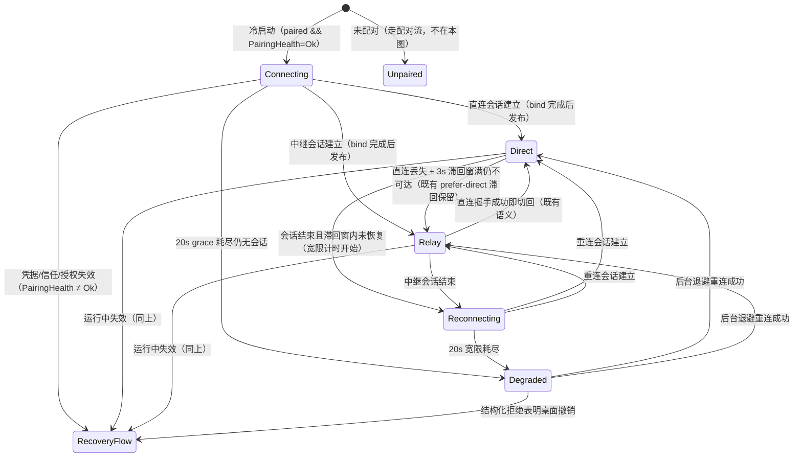

# 统一连接/配对/凭据状态模型（CAP-2 / CAP-3 / CAP-5 契约）

> 取代 `paired: Boolean` + `ConnectionState(Direct/Relay/Offline)` + `engineAvailable` 的分裂事实源。
> 现状证据（Confirmed）：`ConnectionStateMachine.kt:33-35` 状态机初值即 Offline；`RealConnectionClient.kt:748-754` 已配对冷启动 `initialState()` 返回 Offline；`AppNavHost.kt:133-154` 观察 Offline && paired 即挂全屏遮罩；`ConnectionClient.kt:26-27` `engineAvailable = this !is Offline`。

## 1. 状态模型定义（最小三面）

单一切面拆为三个正交可观察流，避免一个巨型枚举把"展示"与"可操作"再次耦合：

```kotlin
/** 承载/展示面（取代 ConnectionState 的 Offline 语义拆分）。 */
sealed interface TransportStatus {
    data object Connecting : TransportStatus   // 冷启动后、尚未建立过会话的宽限态
    data object Reconnecting : TransportStatus // 本进程内曾建立过会话后失去、重连中
    data object Direct : TransportStatus       // 局域网直连会话已建立
    data object Relay : TransportStatus        // 中继会话已建立
    data object Degraded : TransportStatus     // 连接宽限耗尽：缓存可浏览 + 本地能力可用 + 引擎写操作禁用
}

/** 配对/凭据健康面（驱动重配入口与恢复事件）。 */
sealed interface PairingHealth {
    data object Ok : PairingHealth
    data object CredentialMissing : PairingHealth // 已配对元数据在、包裹私钥文件缺失（冷启动可同步检测）
    data object CredentialInvalid : PairingHealth // 私钥不可解 / 运行中 SecretsInvalidatedException
    data object PairingRevoked : PairingHealth    // 桌面授权失效：结构化拒绝 + 本地已配对且公钥未变
    data object TrustMismatch : PairingHealth     // 桌面身份锚变化：信任锚校验失败（IdentityVerificationException）
}

/** 会话/就绪面（写操作唯一事实源，CAP-5）。 */
val commandReady: StateFlow<Boolean>   // = CommandChannel.binding != null，可观察
```

派生规则（UI 与协调层只允许消费派生值，不允许自行拼接布尔）：

| 消费面 | 派生自 | 规则 |
| --- | --- | --- |
| 全屏遮罩门 | —— | 退役（不存在"遮罩门"派生；见 supersessions.md） |
| 紧凑状态指示 | TransportStatus | 仅 Connecting / Reconnecting / Degraded 显示小图标/小状态条 |
| 降级横幅（数据截止/写操作禁用说明） | TransportStatus = Degraded | 携带 `OfflineSnapshotInfo(snapshotAvailable, dataAsOf)`（沿用 `offlineInfo()/offlineInfoTick` 既有供给） |
| 重配入口（含原因文案） | PairingHealth ≠ Ok | 网络类失败（TransportStatus 降级但 PairingHealth=Ok）不出现 |
| 对话发送（!commandReady） | commandReady | 进入离线待发箱（§4.4），不报"桌面引擎不可达" |
| Tasks/Memory/通知响应等写控件 enabled | commandReady（&& 业务 busy 态） | 不再读 `engineAvailable`；逐项禁用并说明原因 |
| 离线待发箱 flush 守门 | commandReady && paired | 取代 `engineAvailable && paired`（`AppModelContainer.kt:107-122`；载体从 QuickNoteQueue 换为待发箱） |
| 起始路由 / 运行中导航 | paired + 恢复事件 | 见 §5 |

`engineAvailable` 及 `ConnectionState.Offline` 在迁移完成后删除（或收敛为内部实现细节）；不允许新旧两套判据并存消费。

## 2. 状态转换



要点：

- **直连↔中继切换不经过 Connecting/Reconnecting**：两者都是"在线"态；切换瞬间的写操作就绪由 commandReady 单独守门（滞回窗内 Direct 展示保持、binding 已空 → 控件禁用，见 §4）。
- **滞回保留**：`ConnectionStateMachine` 既有 3s 滞回（`HYSTERESIS_MS`）与 prefer-direct 语义不变，只改状态词汇与初值。
- **Degraded ≠ 停止重连**：Degraded 下后台退避重连（1s→30s 封顶，既有 BackoffPolicy）继续；恢复即回 Direct/Relay、撤下降级横幅。

## 3. 20 秒 grace 起止条件

| 项 | 条件 |
| --- | --- |
| 计时开始（Connecting） | 冷启动 `init` 中 `store.paired && PairingHealth=Ok` 且编排启动的那一时刻 |
| 计时开始（Reconnecting） | 已建立会话结束（session loop 退出 + unbind）且滞回窗内未恢复 |
| 计时取消 | 任一承载会话 bind 完成并发布 Direct/Relay |
| 计时耗尽 | 20s 内无会话 → Degraded（UI 非阻断提示；重连继续） |
| 常量 | `CONNECT_GRACE_MS = 20_000L`，注入 sleep 缝（镜像 `ConnectionStateMachine` 的可测时间控制） |

冷启动第一帧发布 **Connecting**（取代现状"第一帧即 Offline+遮罩"，Finding 1 / Deduction 1：延长 NSD 超时不可独立修复，必须解耦展示语义与底层未连上事实）。

## 4. commandReady 时序与 `sessionActive/CommandChannel.binding` 关系

现状缺陷（Confirmed，Finding 7）：连接建立先 `machine.onDirectEstablished()` 再 `startSessionLoop()` 内 `bind()`（`RealConnectionClient.kt:452-455,688`）；连接结束先 unbind（`startSessionLoop` finally，`:737-745`）再 `onDirectLost`，且滞回窗内 Direct 展示保持 → "界面正常、发送才报不可达"。

强制时序不变量：

1. **建立**：会话循环内 `commandChannel.bind()` 成功 → 发布 `commandReady=true` → 才发布 Direct/Relay（把 `onDirectEstablished()` 移到 bind 之后，或经绑定回调驱动）。
2. **断开**：`unbind()`（内部同步置 `commandReady=false` 并失败全部 pending）→ 再进入状态机丢失/滞回流程；UI 在任一时刻观察到的 (展示态, commandReady) 组合不得出现"在线展示 + 不可发送但仍可点击"。
3. **CommandChannel 升级**：`sessionActive` 从 `val binding != null` 布尔 getter（`CommandChannel.kt:62-64`）改为可观察 `StateFlow<Boolean>`（bind/unbind/shutdown 处同步发布）；`RealConnectionClient` 经既有 `commandChannel` 注入对外转发为 `commandReady`。`CommandSender.sessionActive` 接口语义同步收敛为该流（全仓 grep 确认生产 UI 当前无消费，迁移零冲突）。
4. **对话发送的离线策略（用户裁决 2026-09-08：队列化，取代"禁用+不排队"的原推荐）**：`!commandReady` 时对话发送不禁用也不报错——消息进入**离线待发箱**，气泡呈待发态并提示"网络不可用，网络恢复后自动发送"。
   - 条目：`{commandId（UUID，跨重发稳定）, roleId, conversationId（本地占位会话传 null，规则同 sendMessage 现状，`ChatViewModel.kt:456`）, content, 本地消息 id}`；
   - flush 触发：commandReady && paired（容器收集器）→ 逐条按序走既有 chat.send 管线（含 `adoptChatIds` id 对齐），**一次一条**、等本轮流式 done 后再发下一条（对齐桌面 busy 串行语义）；
   - 结果处理：成功删条目；连接类失败（ConnectionError/超时）留队待下次恢复；桌面业务错误删条目并按既有 failSend 路径提示（不无限重试坏消息）；
   - 幂等：重发复用同一 commandId——桌面 dispatcher 幂等缓存（`companion_dispatch.rs:102-133`，commandId → ack 全指令通用）命中即返回首次结果，网络重传/竞窗重发零重复执行；
   - 落盘（用户裁决 B）：队列变更（入队/删条目）同步持久化到应用私有目录，复用既有 `KeystoreSnapshotCipher` 加密（与快照缓存同级保护）、原子写（临时文件+重命名，镜像 `PairingSecrets.atomicWrite` 模式）；容器启动时恢复队列并发布，待发消息在对应会话（含本地占位会话）恢复为待发态气泡；进程被杀/冷启动不丢队列；
   - 并发守卫保留：thinking/responding 期间的新发送仍按现状忽略（`ChatViewModel.kt:430`），待发条目不置 responding。
   - 现状缺口顺带闭合：`QuickNoteQueue.flush()` 为纯内存 mock（`QuickNoteQueue.kt:38-44`，从未真实发送）；速记条 UI 与 `QuickNoteQueue` 随遮罩退役删除，其"离线录入无丢失"语义由待发箱真实承接。
5. **flush 守门**：`AppModelContainer` init 收集器改为驱动待发箱 flush，守门 `commandReady && connection.paired.value`（不虚假标记已发送）。
6. **Onboarding 边界**：引导流 sendMessage 不接入待发箱（一次性在线场景），按 commandReady 禁用——避免把队列机制扩散到一次性流程。

## 5. 凭据生命周期与统一恢复事件（CAP-3 核心）

### 5.1 SecretsProvider 拆分

```kotlin
interface SecretsProvider {
    /** 已配对设备加载既有私钥：文件缺失抛 MissingSecretsException；不可解抛 SecretsInvalidatedException。 */
    fun loadExistingStaticPrivateKey(): ByteArray
    /** 首次配对/换绑时创建并落盘新私钥（仅在未配对或已确认 wipe 后调用）。 */
    fun createForPairingStaticPrivateKey(): ByteArray
    fun wipe()
}
```

- 调用点分类（`RealConnectionClient.kt:488,577,603` 三处 `loadOrCreate` 调用点）：`runDirectLoop`/`runRelayLoop`（已配对重连路径）→ `loadExisting`；`runPairing`/`connectDirect(needsPairingAuth=true)`/`connectViaRelay(needsPairingAuth=true)`/`waitDesktopConfirmAndRetry`（配对路径）→ `createForPairing`（pairWithQr 已先 join wipeJob，时序安全）。
- **禁止**：任何"已配对却无既有私钥"的场景走创建路径。拒绝备选"加 requireExisting 布尔参数"——两个显式方法的生命周期语义不可混淆（调查 B.4 原文方向）。
- `healCorruptPairingIfAny()`（`:200-213`）扩展：除既有元数据判空外，增加"store.paired 但包裹私钥文件不存在"检查（同步段即可判文件存在性，不解密）。命中 → 不生成新身份，走 §5.2。
- 注记（调查 Side Finding，未定案）：系统备份/恢复可能导致 SharedPreferences 与私有文件不同步（Manifest 未配置 backup rules），是"元数据完整 + 私钥缺失"的潜在触发来源之一；本规格不改动备份策略（Non-goal），§5.2 恢复闭环对该触发源同样成立。

### 5.2 统一恢复事件与原子协调

连接层发布单一事件（供上层订阅，替代"只改 `_paired` 期待路由自动响应"的现状缺陷，Finding 11）：

```kotlin
sealed interface PairingRecoveryReason { CredentialMissing; CredentialInvalid; PairingRevoked; TrustMismatch }
val pairingRecovery: SharedFlow<PairingRecoveryReason>  // 或并入 PairingHealth 流派生
```

上层（AppModelContainer + AppNavHost 分工）收到事件后按固定顺序**原子协调**（一个处理器内完成，不留中间撕裂态）：

1. 终止连接/命令/流式：`sessionJob` 取消、nsd 停止、`commandChannel.shutdown()`（pending 全失败）、`streamCoordinator.reset()`；
2. 清除配对元数据与密钥：`store.clear()` + `secrets.wipe()`（异步 wipeJob，重配对前 join，沿用 P3 模式）；
3. 清除不可信快照与通知：`snapshotStore.clear()`、`notifications.clear()`（镜像 `AppModelContainer.unpair()`，`:141-147`）；
4. **保留离线待发箱**：待发消息队列原样不动（恢复连接后续发，FR-43 无丢失语义延续）；
5. 显式导航：`navController.navigate(PAIRING) { popUpTo(0) { inclusive = true } }`（镜像 SettingsRoute.onUnpair 导航语义）；
6. 显示准确重新配对原因：按 reason 映射用户文案（见 `qr-and-unbind-semantics.md` §4），经 Snackbar/配对屏提示。

发布点：

- **冷启动 CredentialMissing**：`init` 同步段检测命中 → 置 `paired=false`（保证 `AppNavHost.startDestination` 的 `remember{}` 首组合定格落配对流，Finding 11 的冻结机制约束）+ 发布原因供配对屏展示"检测到本机配对密钥缺失，请重新扫码"。
- **运行中 CredentialInvalid**：既有 `SecretsInvalidatedException` 捕获点（`runDirectLoop:458`/`runRelayLoop:519`/配对路径 `:294,349`）从"只调 handleSecretsInvalidated"升级为发布恢复事件；`handleSecretsInvalidated()` 的裸清理职责并入上述原子序列。
- **TrustMismatch**：`IdentityVerificationException`（`verifyTrustAnchor`）在已配对上下文命中 → 恢复事件（配对流程内命中则按配对失败呈现，不清既有配对态——此时本就未配对）。
- **PairingRevoked**：会话/重连收到桌面结构化拒绝 `pairingRejected` 且本地 paired=true 且本机公钥未变 → 恢复事件（机制见 `qr-and-unbind-semantics.md` §3）。

## 6. 故障分类（网络 vs 配对失效）

| 信号 | 分类 | UI 动作 |
| --- | --- | --- |
| NSD 超时/IO、中继连接失败、握手超时（无结构化拒绝） | 网络类 → TransportStatus 走 Connecting/Reconnecting/Degraded | 紧凑指示/降级横幅 + 重试信息；**无重配 CTA** |
| `pairingRejected` Notice + 本地未配对（配对流程中） | QR/窗口类（pairingWindowClosed / nonceConsumed） | 配对屏结构化失败文案（见 qr-and-unbind-semantics.md §4） |
| `pairingRejected` Notice + 本地已配对且公钥未变 | PairingRevoked | 重配入口 + 原因 + 恢复事件 |
| 信任锚校验失败（已配对重连） | TrustMismatch | 重配入口 + 原因 + 恢复事件 |
| 私钥文件缺失（冷启动）/ 密文不可解 | CredentialMissing / CredentialInvalid | 恢复事件 → 配对流 + 原因 |
| 桌面 Agent/LLM 错误（如"模型服务暂时不可用"） | 与连接无关（分案） | 不进入本模型分类 |

**禁止**：手机以"连接被关闭"本身猜测失败类别（Finding 6：承载层合并文案无法表达准入被拒）。

## 7. Debug 预设与 Fake 换装

- `DebugConnectionMode` 扩展为六档：DIRECT / RELAY / CONNECTING / RECONNECTING / DEGRADED /（OFFLINE 并入 DEGRADED 或保留映射），设置页隐藏入口与测试同步更新。
- `FakeConnectionClient` 按新三面模型重写 mock 输出，Preview/既有 VM 测试注入语义不变。
