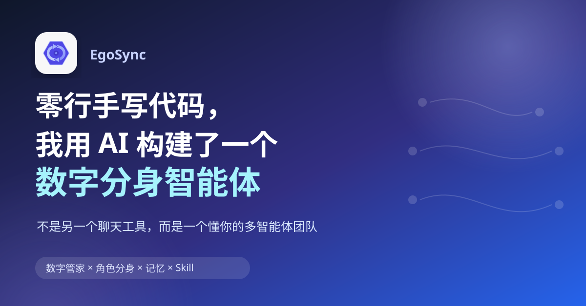
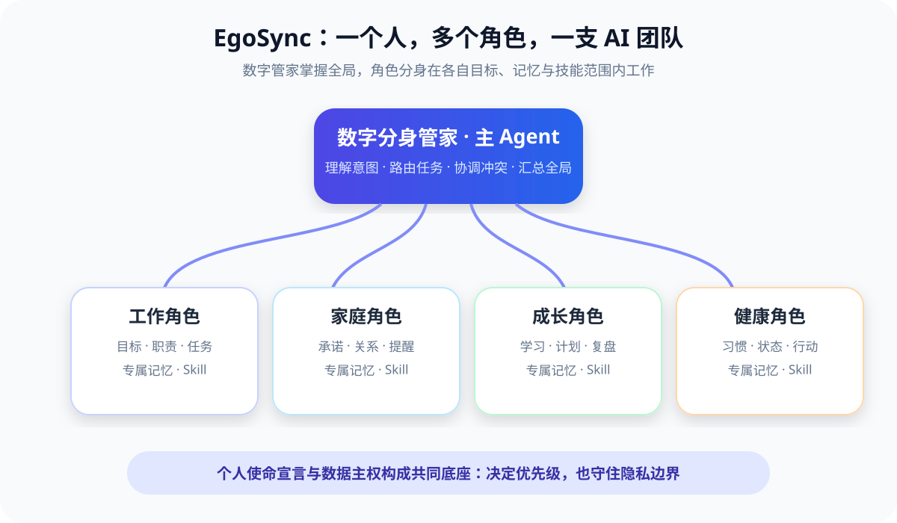

# 零行手写代码，我尝试用AI魔法构建了一个数字分身智能体



AI编程浪潮席卷而来。

作为一名深耕AI领域多年的BA，我常常在想，当前的大模型和Harness这么强，那有没有可能，从零开始，不写一行代码，端到端构建一个智能体应用呢？

于是，在过去两个月，我做了一个有点“疯狂”的实验：**利用业余时间，不亲手写一行代码，只通过与 AI 对话，完成一款桌面应用的产品设计、架构、开发、测试和迭代。**

它叫 **EgoSync**。

不过，“零行手写代码”并不等于“一句话生成应用”，我是基于SDD框架来构建的，但我没有选择Superpowers、OpenSpec等效率更高的SDD编程框架，而是选择了BMad，虽然开发进度推进慢，但它更像我们实际的开发流程，一步步稳扎稳打。

整个的过程像是我带领一支 AI 团队：我提出问题、定义产品边界、做关键决策、审查结果并完成验收；AI 则负责把需求变成 PRD、架构、代码和测试。当结果不符合预期时，我不会亲自下场修改代码（实际上，Typescript和Rust我也完全不懂），而是继续提供证据、澄清意图，让 AI 找到根因并完成修复。

这个过程中，我逐渐意识到：AI 不仅可以帮我们构建一个应用，也可以帮助我们重新思考——**一个真正属于个人的数字分身，究竟应该是什么？**

## 一、EgoSync 是什么？

> 一句话介绍：**EgoSync 是一套以人生角色为核心、由数字分身管家统一协调的个人多智能体系统。**

我们每个人都不是单一身份。

在公司里，你可能是BA、算法、SE或团队管理者；回到家，你是伴侣、父母或子女；独处时，你又可能是学习者、创作者、健身者。每个角色都有不同的目标、责任、上下文和判断标准，但这些角色最终共享同一份时间、精力和注意力。

传统效率工具通常把一切压缩成任务列表，传统 AI 助手则把一切装进同一个聊天框。EgoSync 选择了另一条路：**把这些角色外化为彼此独立、又能相互协作的 AI 分身。**



在这套架构中：

- **数字分身管家是主 Agent**：理解你的意图，掌握全局信息，把任务交给合适的角色，并在角色发生冲突时给出协调建议。
- **角色分身是子 Agent**：每个角色拥有自己的目标、职责、对话、任务、记忆和 Skill。例如，“BA”可以专注需求分析，“健康管理者”可以跟踪训练计划，“内容创作者”可以协助选题与写作。
- **个人使命宣言是共同的决策底座**：当工作、家庭、成长等角色争夺时间时，系统不是简单比较哪个截止日期更近，而是回到“什么对你真正重要”。

这带来了几个我认为很关键的变化。

**第一，分身是持续存在的。** 普通助手完成一次问答后，下一次往往又从陌生人开始；EgoSync 会在不同角色的边界内沉淀结构化记忆，逐渐理解你的目标、偏好和历史选择，而且重要结论可以追溯到来源。

【BA、健身管理、父亲三个角色的记忆截图，展示来源对话】

**第二，它不只会聊天，还会推进事情。** 你可以让管家拆解并分发任务，也可以直接进入某个角色对话。任务会进入统一的管理视图，并根据目标、期限和上下文进入四象限，而不是要求你为每件事机械地标注优先级。

【管家委派任务截图、任务截图】

**第三，每个角色都可以拥有不同能力。** 管家和角色能够分别配置 Skill，也可以通过 MCP 接入外部工具。你可以让“研究者”擅长检索与整理，让“内容创作者”专注写作，而不是给所有 Agent 塞入同一套臃肿能力。

【BA、健康管理、父亲的skill截图】

**第四，数据首先属于用户。** EgoSync 采用本地优先的桌面架构，角色、任务、记忆和设置保存在本地；模型采用 BYOK（自带 API Key）方式，用户可以自主接入大模型能力。

从实现上看，EgoSync 是一款基于 Tauri 的桌面应用：React 负责界面，Rust 负责本地业务与数据安全，SQLite 保存个人数据，OpenCode 作为 Agent 引擎提供工具调用、Skill、子 Agent 与 MCP 能力。但对使用者来说，这些技术最终只服务于一个目标：**你面对的不是一堆模型和工具，而是一支越来越懂你的个人 AI 团队。**

## 二、为什么要做 EgoSync？

我用过很多 AI 产品。它们很强，能写文案、查资料、生成代码、分析文件，像一个不断扩充的工具箱。

但工具箱并不知道使用它的人是谁。

它不知道我当前最重要的目标是什么，不知道我同时承担哪些角色，不知道哪些承诺不能被牺牲，也不知道今天这个看似紧急的任务，是否正在挤掉一件长期重要的事。每次使用，我都要重新提供背景、解释偏好、描述目标。它拥有能力，却没有关于“我”的连续认知。

因此，我越来越难把普通 AI 助手称为“数字分身”。**真正的数字分身，不只是会替我做事，还应该理解我为什么做、站在哪个角色上做，以及这件事和我的长期方向有什么关系。**

EgoSync 的重要灵感来自史蒂芬·柯维的《高效能人士的七个习惯》，尤其是两个理念：**以终为始**和**要事第一**。

“以终为始”提醒我们，行动之前要先理解自己想成为什么样的人。因此在 EgoSync 中，使命宣言不是装饰性的个人简介，而是管家协调目标和解释建议时的最高层依据。

“要事第一”则提醒我们，真正改变人生的事情，往往不是最吵闹的事情。健康、学习、关系建设、长期创作通常重要但不紧急，很容易被眼前的消息和截止日期挤掉。EgoSync 因此引入了动态四象限与“大石头”思路，试图主动保护这些长期重要的投入。

柯维还强调：人是多个角色的综合体。只优化“职业表现”，可能会透支健康和家庭；只追求短期平衡，也可能回避真正重要的突破。平衡不是让每个角色平均分配时间，而是让你看见所有角色，并在当下做出有意识的选择。

这也是 EgoSync 最想解决的问题：**不是让人完成更多任务，而是帮助人减少内在角色之间的混乱，把有限的精力投入真正重要的方向。**

## 三、EgoSync 怎么用？

假设这一周，我同时有三件重要的事：**周五前完成 EgoSync 产品介绍文章的初稿，周六下午陪儿子看电影，周日参加社区跑团活动。**

它们分别对应我的三个角色：工作中的 **BA**、生活中的 **健康管理**，以及家庭中的 **父亲**。下面就用这个真实场景，走一遍 EgoSync 的主要使用流程。

### 1. 为不同角色建立各自的工作空间

在 EgoSync 中，创建角色有两种方式：通过自然语言让数字分身管家提出角色建议，或者直接手工创建。

#### 方式一：通过自然语言创建

你可以把下面三个 Prompt 分别发送给数字分身管家。管家会根据描述生成角色创建提议，展示角色名称、目标、图标和颜色；确认或修改后，角色才会真正创建。

**创建 BA 角色：**

```text
请帮我创建一个名为“BA”的角色。目标是：负责AI产品方案设计和落地。
```

**创建健康管理角色：**

```text
请帮我创建一个名为“健康管理”的角色。目标是：负责管理我的运动、睡眠、身体状态和恢复计划，帮助我维持规律锻炼，并在工作繁忙时保护必要的健康投入。
```

**创建父亲角色：**

```text
请帮我创建一个名为“父亲”的角色。目标是：在忙碌的工作之外，持续投入高质量的陪伴，认真参与孩子的成长。
```

自然语言创建依赖已经配置并可正常使用的 LLM。不同模型生成的说明文字可能略有不同，但在真正创建前，EgoSync 会先展示提议，最终由用户确认。

#### 方式二：手工创建

你也可以手工创建角色，点击侧边栏的“添加角色”按钮，填写角色名称和目标，选择图标与颜色，然后点击“创建角色”。这种方式不依赖模型，结果也更加直接、确定。

角色创建后，BA、健康管理和父亲会分别拥有独立的对话、任务、记忆与设置空间。BA 可以专注于需求和产品工作，健康管理可以记录运动与恢复，父亲角色则负责家庭承诺和亲子安排。不同角色的上下文彼此隔离，产品需求不会和跑步记录、亲子活动混在一起。

### 2. 让管家拆解并分发任务

三个角色准备好后，我把这一周的安排一次性告诉数字分身管家：

> 本周五要完成EgoSync产品介绍文章的初稿，周六下午是家庭日，陪儿子去看《功夫女足》，周日要参加社区跑团的跑步活动

管家会结合已有角色，从全局识别这段话中的不同事项，并委派给不同的角色：

- 将“完成 EgoSync 产品介绍文章初稿”交给 **BA**；
- 将“周六下午陪儿子看《功夫女足》”交给 **父亲**；
- 将“周日参加社区跑团活动”交给 **健康管理**。

**预期结果：**管家应识别出三类事项，并将任务委派给对应角色。在对应角色的任务清单中应该可以看到相应的任务想。

如果你想直接把任务下个对应角色，也可以绕过管家，直接进入对应角色创建任务或发起对话。无论从管家还是角色空间开始，已经创建的任务都会汇总到管家的全局任务视图中。

### 3. 给角色装上合适的 Skill

角色决定了“谁来负责”，Skill 则决定了“它会用什么方法完成”。针对这三个角色，我可以分别配置不同的能力组合：

- **BA**：需求澄清、用户研究、竞品分析、PRD、结构化写作、验收与复盘等 Skill；
- **健康管理**：训练计划、跑步活动准备、习惯追踪、运动记录和恢复建议等 Skill；
- **父亲**：亲子活动规划、家庭日程整理、出行准备和家庭事项提醒等 Skill。

配置完成后，在具体对话中输入 `@`，可以从当前角色已经启用的 Skill 中进行选择。例如，让 BA 使用结构化写作 Skill 生成文章提纲，让健康管理使用跑步计划 Skill 准备周日活动，或让父亲角色使用亲子活动规划 Skill 整理观影安排。

这种设计更像给不同团队成员配备各自的专业工具，而不是让一个万能助手在所有场景中盲目发挥。需要连接日历、文档或其他外部服务时，还可以为管家或指定角色单独绑定 MCP Server；实际调用是否成功，取决于对应服务是否已经正确配置并处于可用状态。

### 4. 用仪表盘看全局，而不是被列表淹没

回到管家的仪表盘，我能看到 BA、健康管理和父亲三个角色的状态，以及任务、记忆、对话和待处理事项等统计。筛选某个角色，就能快速查看该角色当前承担的任务。

随着周五临近，文章初稿会成为 BA 角色下“重要且紧急”的任务；周六的家庭日和周日的跑团活动虽然不应该被工作侵占，也需要提前作为重要事项被保护。通过全局任务和四象限视图，我可以同时看到三种角色责任，而不是只盯着最紧急的工作截止日期。

当 BA 的任务不断增加，并开始挤压家庭日或运动安排时，数字分身管家应该帮助我看见冲突、重新排序，而不是默默把更多事情塞进已经排满的时间里。

### 5. 让系统在使用中逐渐理解你

在持续使用中，EgoSync 会围绕不同角色沉淀各自值得保留的信息。

BA 角色可以逐渐记住我对 EgoSync 的产品定位、常用术语、需求判断标准和写作偏好；健康管理角色可以记住我的运动频率、跑步习惯、身体状态和恢复节奏；父亲角色则可以记住家庭承诺、孩子感兴趣的活动，以及我希望长期保护的陪伴时间。

这些记忆按角色隔离，并保留来源。用户可以查看记忆来自哪段对话，也可以主动遗忘不再需要或不准确的信息。BA 不需要知道我的跑步配速，健康管理也不会把产品需求混进训练建议里；数字分身管家则可以在需要全局权衡时，基于三个角色的任务和上下文给出更完整的提醒。

下一次再安排类似的一周时，我不必重新解释自己的工作方式、运动习惯和家庭优先级。到这里，AI 才开始从一个“随叫随到的工具”，变成一组能够持续理解并协助不同人生角色的数字分身。

## 四、未来，我希望 EgoSync 走向哪里？

EgoSync 现在已经验证了一个基本方向：以角色组织 Agent，比以工具组织 Agent 更接近个人数字分身。但角色创建出来后，冷启动仍然存在——一个“BA分身”应该具备哪些能力？一个“健康管理者”需要哪些方法、模板和工具？用户不应该先成为提示词工程师，才能用好数字分身。

所以下一步，我最想推进两件事。

**第一，为主流角色沉淀开箱即用的 Skill 套件。**

例如，BA角色可以拥有需求澄清、用户研究、PRD、路线图和复盘 Skill；内容创作者可以拥有选题、研究、结构设计、编辑和多平台发布 Skill；健康管理者可以拥有目标拆解、习惯追踪和阶段复盘 Skill。用户创建角色后，不必从空白开始，而是先获得一套经过验证的基础能力，再根据自己逐步调整。

**第二，建立角色 Skill 套件的共享市场。**

未来，每个人都可以分享自己打磨出的角色模板、工作方法和 Skill 组合。优秀的销售、开发者、家长或学习者，可以把自己的实践经验封装成可复用的“角色能力包”。其他用户导入后，再与自己的目标、记忆和偏好结合，形成真正个性化的分身。

我期待的市场不是简单堆放提示词，而是让经过实践验证的方法能够流动：**你分享的不是一个万能答案，而是一种把某个人生角色做得更好的方式。**

EgoSync 仍然处在很早的阶段，还有许多问题需要验证。但这次“零行手写代码”的实验已经让我看到一种可能：未来的软件不只是等待点击的工具，也可以是一组理解目标、拥有记忆、能够协作并接受人类最终裁决的智能体。

也许每个人都不需要一个无所不能的超级 AI。

我们更需要的，是一个懂得全局的管家，和一群愿意陪我们把每个重要角色活好的数字分身。

## 五、欢迎加入 EgoSync 的共建

我已经把 EgoSync 的整个项目分享到了内源社区，欢迎大家下载使用、体验其中的功能，也欢迎把使用过程中的想法和问题反馈给我。无论是一个真实的使用场景、一条改进建议，还是一次意料之外的使用结果，都可能帮助 EgoSync 变得更好。

这个项目的初始搭建由我一个人利用业余时间完成。一个人从产品构想、需求梳理，到设计、开发和验证，难免会有遗漏：可能存在尚未发现的 Bug，也可能有验证不充分的地方；有些设计是基于我当前的理解，未必覆盖所有人的真实需求。换句话说，理想中的数字分身，和现实中刚刚起步的 EgoSync 之间，可能还有不小的距离。

所以，我真诚地欢迎大家：

- 试用 EgoSync，看看它是否能解决你的真实问题；
- 提出 Issue，反馈 Bug、体验问题和没有覆盖到的场景；
- 分享你的使用方式，帮助我发现新的角色和需求；
- 对产品设计和实现提出批评指正。

EgoSync 不会因为一次发布就完成，它更像是一个需要在真实使用中持续校准的长期实验。希望它不只是我一个人的项目，也能在大家的反馈和参与下，逐渐演进成一个真正有用的数字分身系统。

如果你愿意参与，欢迎从一次体验、一个 Issue，或一句直接的批评开始。
