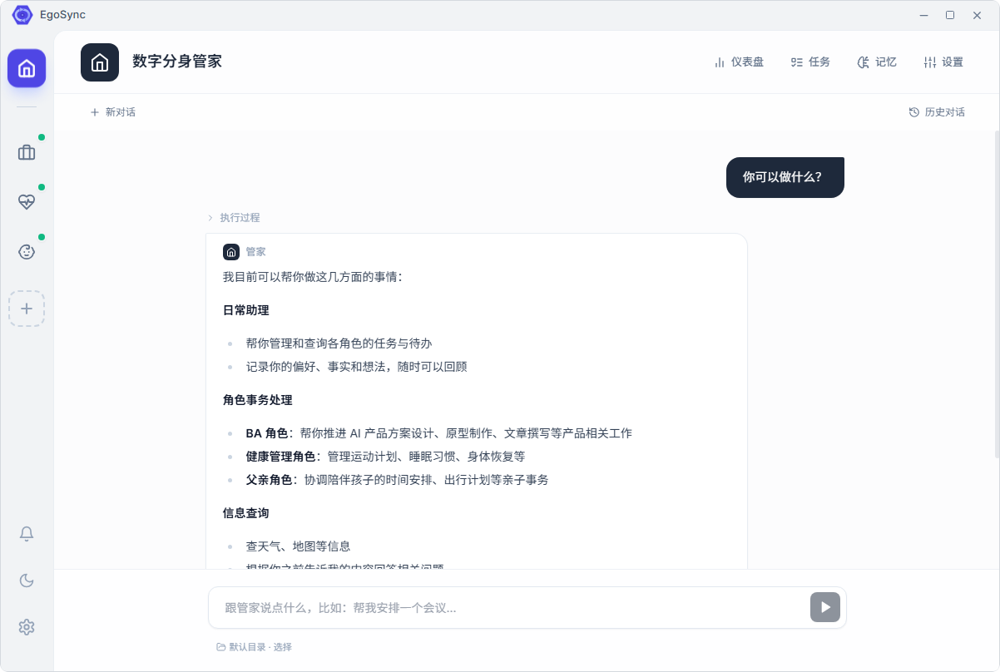

# EgoSync 用户操作指南

欢迎使用 EgoSync。本指南面向第一次使用应用的用户，也适合已经使用过应用、希望系统了解全部功能的用户。

EgoSync 的核心思路是：由**数字分身管家**负责接收和整理你的意图，再由不同的**角色 Agent**负责具体领域；系统会把对话、任务、记忆、提醒和复盘连接起来，帮助你持续推进重要事项。

## 阅读顺序

### 新用户

1. [快速开始](./01-快速开始.md)
2. [管家、角色与工作区](./02-管家与角色.md)
3. [对话、路由与 Agent 能力](./03-对话与Agent能力.md)
4. [任务与智能四象限](./04-任务与四象限.md)

### 日常使用

5. [记忆、使命与冲突仲裁](./05-记忆使命与冲突.md)
6. [主动工作、简报与周复盘](./06-主动工作与复盘.md)
7. [通知、仪表盘与活动统计](./07-通知仪表盘与活动统计.md)

### 高级配置与数据管理

8. [Skill、MCP 与模型服务](./08-Skill-MCP与模型服务.md)
9. [数据导入、导出与隐私](./09-数据与隐私.md)
10. [故障排查与术语](./10-故障排查与术语.md)

## 先了解三个概念

| 概念 | 作用 | 典型用法 |
| --- | --- | --- |
| 管家 | 统一入口，理解你的意图、安排任务、汇总全局情况 | “帮我安排本周重点” |
| 角色 | 面向某一领域的专属 Agent，拥有自己的目标、语气、任务和记忆 | “让产品经理角色拆解需求” |
| Skill / MCP | 扩展 Agent 的做事方法和外部工具 | “使用会议纪要 Skill 整理这份内容” |

## 文档中的界面约定

- **点击**：使用鼠标左键点击按钮、标签或卡片。
- **选择**：从下拉框、单选框或复选框中选择一项。
- **保存**：点击“保存”“保存任务”或类似按钮后，等待成功提示。

## 功能状态说明

本指南按产品设计和当前应用界面整理。部分高级能力（例如冲突仲裁、主动简报、Skill 发现）可能由管家在对话中按条件触发，而不是始终显示独立按钮；如果你的版本没有看到对应入口，请先确认模型服务、调度器和相关能力配置已经启用。